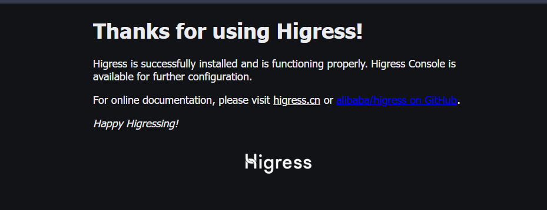

# 使用 Higress 作为 Spring AI Alibaba AI 应用的 AI 网关

## Higress 介绍

Higress 是一款云原生 API 网关，内核基于 Istio 和 Envoy，可以用 Go/Rust/JS 等编写 Wasm 插件，提供了数十个现成的通用插件，以及开箱即用的控制台。

### 什么是 AI 网关

>  AI Gateway = AI Native API Gateway。

AI 网关的本质依然是 API 网关，AI 原生的意义在于，在这样的 API 网关里，AI 是一等公民。API 研发，API 供应，API 消费，以及 API 观测都基于 AI 场景下的需求，演进出全新的能力。

## 启动 Higress Gateway

```shell
cd docker-compose/higress
docker-compose up -d

# 查看 container
$ docker ps
CONTAINER ID   IMAGE                                                                    COMMAND                   CREATED          STATUS          PORTS                                                                    NAMES
c5612d110e15   higress-registry.cn-hangzhou.cr.aliyuncs.com/higress/all-in-one:latest   "supervisord -c /etc…"   52 seconds ago   Up 46 seconds   0.0.0.0:8001->8001/tcp, 0.0.0.0:8080->8080/tcp, 0.0.0.0:8443->8443/tcp   spring-ai-alibaba-higress

# Redis 容器是为了之后的 Higress AI Cache 使用。
```

### Higress 端口说明

- 8001 端口：Higress UI 控制台入口
- 8080 端口：网关 HTTP 协议入口
- 8443 端口：网关 HTTPS 协议入口

浏览器访问 `127.0.0.1:8080`，看到以下内容，则表示 Higress Gateway 启动成功。



### 访问 Higress Console

浏览器访问 `127.0.0.1:8001`，将进入 Higress console：


初始化密码成功之后，将进入 Higress Console。

## AI Gateway 能力体验

经过上面的简单本地部署步骤之后，下面我们将深入体验 Higress 为我们提供的 AI 网关能力。

### Higress AI Gateway 能力概览

Higress 为 AI 应用提供以下五个层面的 AI 网关能力，分别是：

#### 大模型 API 供应

大模型供应能力主要提供：

1. AI 缓存：LLM 结果缓存插件，默认配置方式可以直接用于 openai 协议的结果缓存，同时支持流式和非流式响应的缓存；
2. AI提示词插件：支持在LLM的请求前后插入prompt；
3. AI 代理：实现了基于 OpenAI API 契约的 AI 代理功能；
4. AI 内容安全：通过对接阿里云内容安全检测大模型的输入输出，保障AI应用内容合法合规。

#### 大模型 API 消费

1. AI 数据脱敏：对请求/返回中的敏感词拦截、替换；
2. AI 配额管理：插件实现给特定 consumer 根据分配固定的 quota 进行 quota 策略限流，同时支持 quota 管理能力，包括查询 quota 、刷新 quota、增减 quota；
3. AI 限流：实现了基于特定键值实现token限流，键值来源可以是 URL 参数、HTTP 请求头、客户端 IP 地址、consumer 名称、cookie中 key 名称。

#### 大模型 API 开发

1. AI JSON 格式化：LLM响应结构化插件，用于根据默认或用户配置的Json Schema对AI的响应进行结构化，以便后续插件处理。注意目前只支持 `非流式响应`；
2. AI提示词模板，用于快速构建同类型的AI请求。

#### 大模型 API 观测

1. AI 可观测：提供AI可观测基础能力，包括 metric, log, trace；
2. IP 地理位置：`geo-ip`本插件实现了通过用户ip查询出地理位置信息。

#### Others

1. AI 历史对话：基于请求头实现用户身份识别，并自动缓存对应用户的历史对话,且在后续对话中自动填充到上下文。同时支持用户主动查询历史对话；
2. AI 意图识别：LM 意图识别插件，能够智能判断用户请求与某个领域或agent的功能契合度，从而提升不同模型的应用效果和用户体验；
3. AI RAG：通过对接阿里云向量检索服务实现LLM-RAG；
4. AI 请求响应转换：通过LLM对请求/响应的header以及body进行修改。

可以看到，Higress 为 AI 应用开发了许多功能不同的插件，大大降低了 AI 应用开发的复杂度，同时保护后端的 AI 应用！

### 创建 Spring AI Alibaba 应用

使用 Spring AI Alibaba 创建一个简单的 AI 应用，为演示如何使用 Higress 的 AI 网关提供后端服务，

1. pom.xml

   引入 `spring-ai-alibaba-starter` 和 `spring-boot-starter-web` 两个最基本依赖：

   ```xml
   <dependencies>
       <dependency>
           <groupId>org.springframework.boot</groupId>
           <artifactId>spring-boot-starter-web</artifactId>
           <version>3.4.0</version>
       </dependency>
   
       <dependency>
           <groupId>com.alibaba.cloud.ai</groupId>
           <artifactId>spring-ai-alibaba-starter</artifactId>
           <version>1.0.0-M3.3</version>
       </dependency>
   </dependencies>
   ```

2. Controller.java

   ```java
   @RestController
   @RequestMapping("/ai")
   public class AIChatController {
   
   	private static final String DEFAULT_PROMPT = "你好，介绍下你自己！";
   
   	private final ChatClient dashScopeChatClient;
   	
   	public AIChatController(ChatClient.Builder chatClientBuilder) {
   
   		this.dashScopeChatClient = chatClientBuilder.build();
   	}
   
   	/**
   	 * ChatClient 简单调用
   	 */
   	@GetMapping("/simple/chat")
   	public String simpleChat(
   			@RequestParam(required = false, defaultValue = DEFAULT_PROMPT)
   			String prompt
   	) {
   
   		return dashScopeChatClient.prompt(prompt).call().content();
   	}
   
   	/**
   	 * ChatClient 流式调用
   	 */
   	@GetMapping("/stream/chat")
   	public Flux<String> streamChat(
   			@RequestParam(required = false, defaultValue = DEFAULT_PROMPT)
   			String prompt,
   			HttpServletResponse response
   	) {
   
   		// 避免流式响应乱码
   		response.setCharacterEncoding("UTF-8");
   		return dashScopeChatClient.prompt(prompt).stream().content();
   	}
   	
   }
   ```

3. application.yaml

   编写如下的配置文件，Dashscope 的 Key 可以在阿里云平台上获取：

   ```yaml
   server:
     port: 18080
   
   spring:
     application:
       name: spring-ai-alibaba-higress-example
   
     ai:
       dashscope:
         api-key: ${AI_DASHSCOPE_API_KEY}
   ```

4. 启动项目访问测试

   ```shell
   $ curl http://127.0.0.1:18080/ai/simple/chat?prompt="你好"
   
   你好！有什么我可以帮你的吗？
   ```

5. 到此，一个使用 Spring AI Alibaba 的简单聊天项目就构建完成了！

### Higress 大模型供应能力体验

Higress 的大模型供应能力提供了四种 AI 插件，这里我们选择其中三个演示。

其他使用请参考 Higress 网关文档：https://higress.cn/en/docs/latest/plugins/ai/api-provider/ai-cache

#### Higress 配置 AI 应用路由


#### AI 缓存


#### AI 代理


#### AI 内容安全


### Higress 大模型消费能力体验


### Higress 大模型开发能力体验


### Higress 大模型观测能力体验


### Higress 其他大模型插件


## 总结

Higress 能够用统一的协议（OpenAI API）对接国内外所有 LLM 模型厂商，同时具备丰富的 AI 可观测、多模型负载均衡/fallback、AI token 流控、AI 缓存等能力。

Spring AI Alibaba 基于 Spring AI 构建，是阿里云通义系列模型及服务在 Java AI 应用开发领域的最佳实践，提供高层次的 AI API 抽象与云原生基础设施集成方案，帮助开发者快速构建 AI 应用。

**通过 Spring AI Alibaba 和 Higress 的结合，能为构建更强大的 AI 应用提供强大助力。**
