# ✍️ 智能写作助手 - Spring AI Graph Demo

本项目是一个基于 [Spring-AI-Graph](https://github.com/alibaba/spring-ai-alibaba/tree/main/spring-ai-alibaba-graph)
的智能写作工作流 Demo，具备自动生成摘要、改写内容、生成标题，并支持基于反馈循环的优化流程。

---

## 🚀 功能

- ✅ 输入原始文本，自动生成摘要
- ✅ 智能判断摘要是否让“用户”满意（通过大模型判断，后续可扩展为用户交互反馈判断）
- ✅ 不满意则自动回退重新生成摘要
- ✅ 摘要通过后自动进行语言优化 + 标题生成
- ✅ 完整流程基于有向图工作流，清晰可追溯
- ✅ 自动生成 PlantUML 流程图，便于可视化

---

## ⚙️ 环境配置

### 1. 添加依赖

```xml

<dependency>
    <groupId>com.alibaba.cloud.ai</groupId>
    <artifactId>spring-ai-alibaba-starter-dashscope</artifactId>
    <version>1.0.0-RC1.1</version>
</dependency>
<dependency>
    <groupId>com.alibaba.cloud.ai</groupId>
    <artifactId>spring-ai-alibaba-graph-core</artifactId>
    <version>1.0.0-RC1.1</version>
</dependency>
```

### 2. 配置 API Key（application.yml）

```yaml
spring:
  ai:
    dashscope:
      api-key: ${AI_DASHSCOPE_API_KEY}
```

---

## ▶️ 快速启动

```bash
# 启动服务
mvn spring-boot:run
```

---

## 🧪 示例接口调用

### 请求接口

```
GET http://localhost:8080/write?text=今天我学习了spring-ai-alibaba-graph的相关概念，spring-ai-alibaba-graph做的特别好， 感觉特别开心
```

### 返回结果（JSON）

```json
{
  "summary": "今日学习了spring-ai-alibaba-graph的相关概念，对其优秀表现感到开心。",
  "summary_feedback": "positive",
  "reworded": "今日深入探索了spring-ai-alibaba-graph的相关概念，不禁为其卓越的表现而感到由衷欣喜。这一学习旅程不仅充实了我的知识库，更让我领略到这一技术的独特魅力与无限潜力。",
  "original_text": "今天我学习了spring-ai-alibaba-graph的相关概念，spring-ai-alibaba-graph做的特别好， 感觉特别开心",
  "title": "《深入探索Spring AI Alibaba Graph：一场技术魅力的发现之旅》"
}
```

---

## 📊 流程图 PlantUML（控制台自动打印）

```plantuml
@startuml
skinparam usecaseFontSize 14
skinparam usecaseStereotypeFontSize 12
skinparam hexagonFontSize 14
skinparam hexagonStereotypeFontSize 12
title "writing assistant flow"
footer

powered by spring-ai-alibaba
end footer
circle start<<input>> as __START__
circle stop as __END__
usecase "summarizer"<<Node>>
usecase "feedback_classifier"<<Node>>
usecase "reworder"<<Node>>
usecase "title_generator"<<Node>>
hexagon "check state" as condition1<<Condition>>
"__START__" -down-> "summarizer"
"summarizer" -down-> "feedback_classifier"
"feedback_classifier" .down.> "condition1"
"condition1" .down.> "summarizer": "negative"
'"feedback_classifier" .down.> "summarizer": "negative"
"condition1" .down.> "reworder": "positive"
'"feedback_classifier" .down.> "reworder": "positive"
"reworder" -down-> "title_generator"
"title_generator" -down-> "__END__"
@enduml
```




