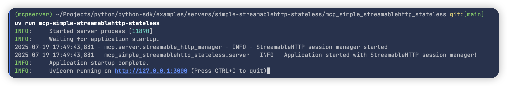
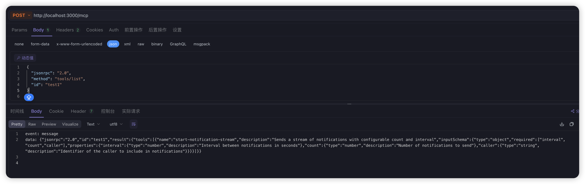
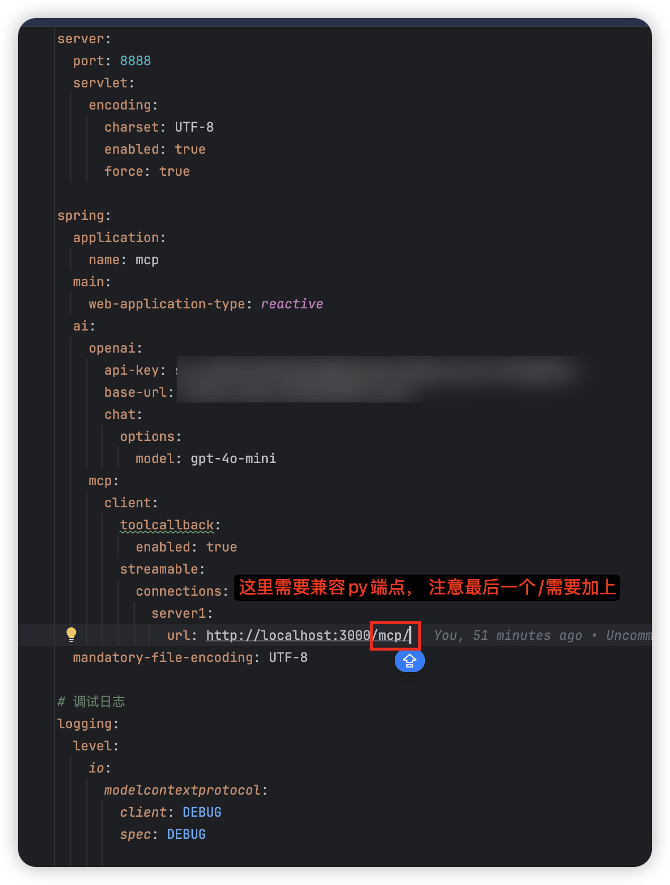
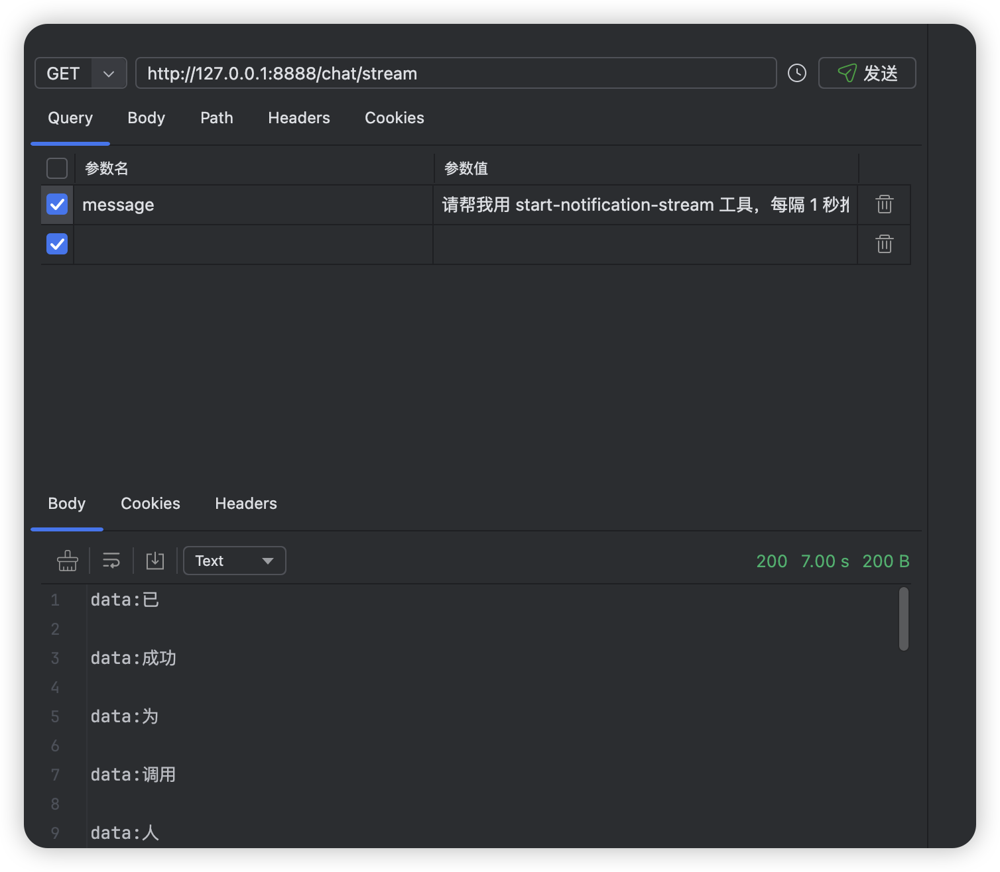

# MCP Streamable Client Demo

## 1.启动py streamable server 

由于mcp java-sdk还未更新streamable server实现， 目前使用python-sdk的server进行实验

server代码地址： https://github.com/modelcontextprotocol/python-sdk/blob/main/examples/servers/simple-streamablehttp-stateless/mcp_simple_streamablehttp_stateless/server.py
按照官方说明启动运行即可：

确保能够调用list_tools接口

## 2.运行Java client

注意， 目前使用的是mcp java-sdk的快照版本， 需要本地编译好0.11.0-SNAPSHOT的依赖，
地址：https://github.com/modelcontextprotocol/java-sdk

配置chatclient以及mcpclient

启动程序， 调用接口

可以看到stream返回
