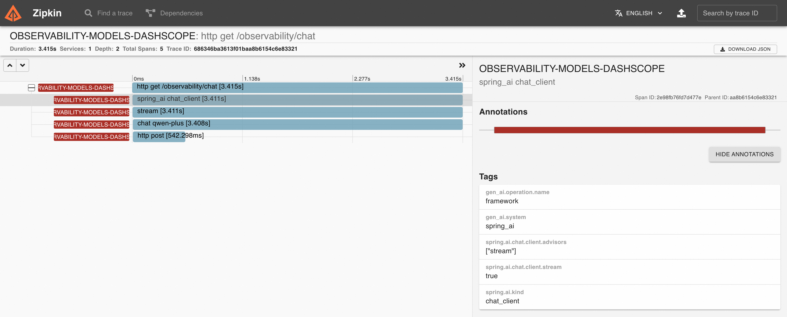
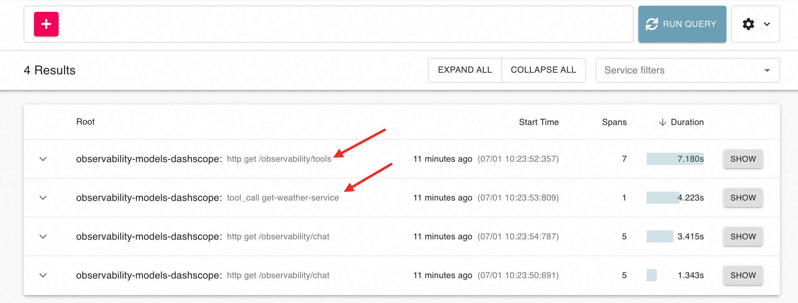
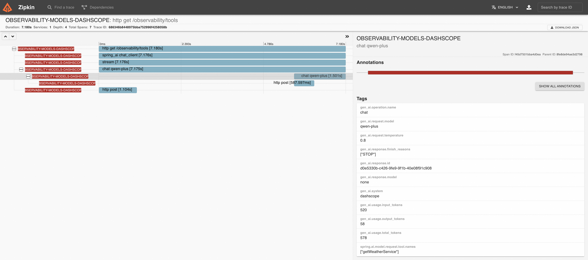
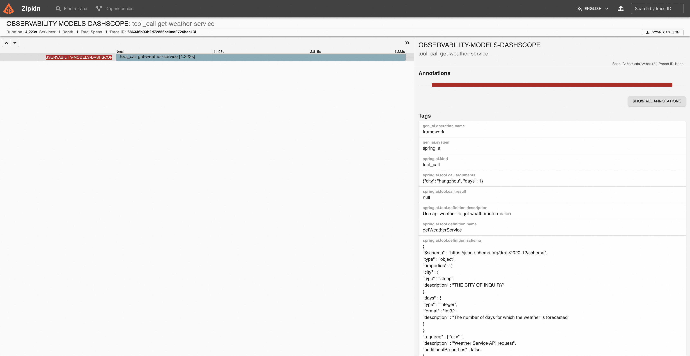
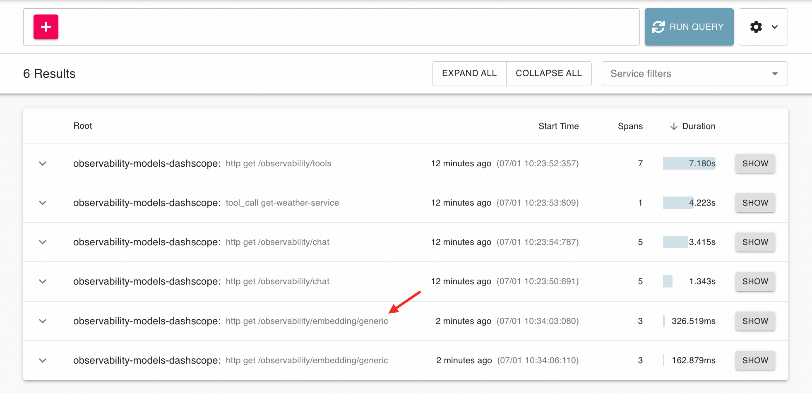
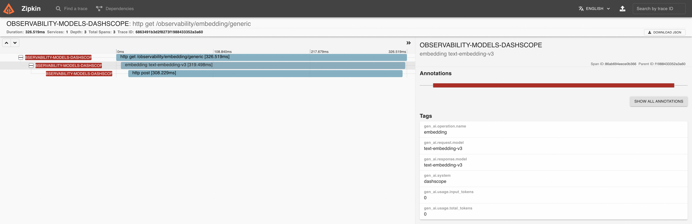
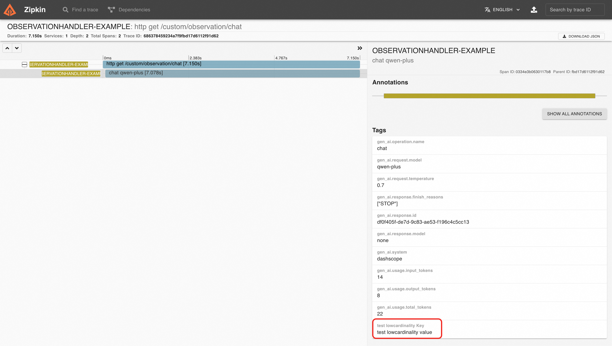

# Spring AI Alibaba 可观测性最佳实践

> 以下最佳实践基于 Spring AI 1.0.0 和 Spring AI Alibaba 1.0.0.2 版本。

## 可观测背景

软件的可观测性（Observability）是指通过系统输出（如日志、指标、跟踪等）来推断其内部状态的能力。在 Spring AI 中基于 Spring 生态集成可观测性功能。包括 `ChatClient（包含 ChatModel 和 Advisor，ToolCall 等）` 、`EmbeddingModel`、`ImageModel` 和 VectorStore 。

## Spring AI Alibaba 可观测性

> Tips: Spring AI 一些输出内容较大且为了数据安全，在默认情况下没有开启打印开关，需要手动开启。
>
> 参考：https://docs.spring.io/spring-ai/reference/observability/index.html#_prompt_content

### 创建 Spring AI Alibaba 项目

下文中的所有项目代码都在：https://github.com/springaialibaba/spring-ai-alibaba-examples/tree/main/spring-ai-alibaba-observability-example/observability-example

####  引入依赖

项目中在跟 pom 中提前引入了 `spring-ai-alibaba-bom`，下文中没有列出。

1. spring-ai-alibaba-starter-dashscope： dashscope starter
2. spring-ai-alibaba-starter-tool-calling-weather：spring ai alibaba 工具 starter
3. micrometer-tracing-bridge-brave zipkin-reporter-brave：观测依赖

```xml
<dependencies>
    <dependency>
        <groupId>org.springframework.boot</groupId>
        <artifactId>spring-boot-starter-web</artifactId>
    </dependency>

    <dependency>
        <groupId>org.springframework.boot</groupId>
        <artifactId>spring-boot-starter-actuator</artifactId>
    </dependency>

    <dependency>
        <groupId>com.alibaba.cloud.ai</groupId>
        <artifactId>spring-ai-alibaba-starter-dashscope</artifactId>
    </dependency>

    <dependency>
        <groupId>com.alibaba.cloud.ai</groupId>
        <artifactId>spring-ai-alibaba-starter-tool-calling-weather</artifactId>
    </dependency>

    <dependency>
        <groupId>io.micrometer</groupId>
        <artifactId>micrometer-tracing-bridge-brave</artifactId>
        <version>1.5.0-M2</version>
        <exclusions>
            <exclusion>
                <artifactId>slf4j-api</artifactId>
                <groupId>org.slf4j</groupId>
            </exclusion>
        </exclusions>
    </dependency>

    <dependency>
        <groupId>io.zipkin.reporter2</groupId>
        <artifactId>zipkin-reporter-brave</artifactId>
        <version>3.4.3</version>
    </dependency>
</dependencies>
```

#### application.yml 配置

1. 开启 spring ai 的观测性功能
2. 开启 spring ai alibaba weather tool 功能

```yml
spring:
  application:
    name: observability-models-dashscope

  ai:
    dashscope:
      api-key: ${AI_DASHSCOPE_API_KEY}
      observations:
        log-completion: true
        log-prompt: true

    # spring ai alibaba weather tool calling config
    alibaba:
      toolcalling:
        weather:
          api-key: ${WEATHER_API_KEY}
          enabled: true

    # Chat config items
    chat:
      client:
        observations:
          # default value is false.
          log-prompt: true
          log-completion: true
          include-error-logging: true

  # tools config items
  tools:
    observability:
      # default value is false.
      include-content: true

    # Image observation is only support openai for spring ai.
    # image:
    #   observations:
    #     log-prompt: true

  http:
    client:
      read-timeout: 60s

management:
  endpoints:
    web:
      exposure:
        include: "*"
  endpoint:
    health:
      # 应用健康状态检查，携带详细新学年
      show-details: always
  tracing:
    sampling:
      # trace 采样信息，记录每个请求
      probability: 1.0
  zipkin:
    tracing:
      endpoint: http://localhost:9411/api/v2/spans
```

#### Controller

此部分为 ai 服务的具体实现，以 ChatClient 为例，Embedding 和 Image 类似：

```java
@RestController
@RequestMapping("/observability/chat")
public class ChatModelController {

	private final ChatClient chatClient;

	public ChatModelController(ChatClient.Builder builder) {
		this.chatClient = builder.build();
	}

	@GetMapping
	public Flux<String> chat(@RequestParam(defaultValue = "hi") String prompt) {

		return chatClient.prompt(prompt).stream().content();
	}

}
```

### 启动依赖项

此 demo 中将数据导入到 zipkin 展示，因此需要启动一个 zipkin：

```yml
services:
  zipkin:
    image: 'openzipkin/zipkin:latest'
    ports:
      - '9411:9411'
```

### 可观测输出

#### ChatClient


登录 zipkin 的控制台，默认情况为 http://localhost:9411/zipkin/ ,点击对应的 trace，可以看到 chatClient 相关的信息：

详细指标介绍请参考 https://docs.spring.io/spring-ai/reference/observability/index.html#_chat_client




#### ToolCalling

在 zipkin 的控制台查看 ToolCalling 对应的信息。






在下面的 tool 模块可以看到 tools 的入参和出参信息：



详细指标介绍请参考 ：https://docs.spring.io/spring-ai/reference/observability/index.html#_tool_calling

#### Embedding Client

在 zipkin 的控制台查看 ToolCalling 对应的信息。





详细指标介绍请参考 ：https://docs.spring.io/spring-ai/reference/observability/index.html#_embeddingmodel

### 扩展 Spring AI 指标

Spring AI 提供了 `ObservationHandler<ChatModelObservationContext>` 机制来扩展可观测信息，您可以加入或者改变观测数据。

#### pom

pom 中只需引入 spring-ai-alibaba-starter-dashscope ，此 starter 会间接引入相关的依赖。

```xml
<dependencies>
    <dependency>
        <groupId>com.alibaba.cloud.ai</groupId>
        <artifactId>spring-ai-alibaba-starter-dashscope</artifactId>
    </dependency>
</dependencies>
```

#### application.yml

```yml
spring:
  application:
    name: observationhandler-example

  ai:
    dashscope:
      api-key: ${AI_DASHSCOPE_API_KEY}
      observations:
        log-completion: true
        log-prompt: true
server:
  port: 8080

management:
  tracing:
    sampling:
      probability: 1.0
  zipkin:
    tracing:
      endpoint: http://localhost:9411/api/v2/spans
```

#### CustomerObservationHandler

扩展实现

```java
public class CustomerObservationHandler implements ObservationHandler<ChatModelObservationContext> {

    @Override
    public void onStart(ChatModelObservationContext context) {
        context.addLowCardinalityKeyValue(new KeyValue() {
            @Override
            public String getKey() {
                return "test lowcardinality Key";
            }

            @Override
            public String getValue() {
                return "test lowcardinality value";
            }
        });
        System.out.println("exec CustomerObservationHandler onStart function! ChatModelObservationContext: " + context.toString() );
    }

    @Override
    public void onStop(ChatModelObservationContext context) {
        System.out.println("exec CustomerObservationHandler onStop function! ChatModelObservationContext: " + context.toString() );
    }

    @Override
    public boolean supportsContext(Observation.Context context) {
        return context instanceof ChatModelObservationContext;
    }
}
```

#### Chat Controller

```java
@RestController
@RequestMapping("/custom/observation/chat")
public class ChatModelController {

    private final DashScopeChatModel dashScopeChatModel;

    public ChatModelController(Environment environment, ObservationRegistry observationRegistry) {
        observationRegistry.observationConfig().observationHandler(new CustomerObservationHandler()) ;
        String dashscopeApiKey = environment.getProperty("spring.ai.dashscope.api-key");
        this.dashScopeChatModel = DashScopeChatModel.builder()
                .dashScopeApi(DashScopeApi.builder().apiKey(dashscopeApiKey).build())
                .observationRegistry(observationRegistry)
                .build();
    }

    @GetMapping
    public String chat(@RequestParam(name = "message", defaultValue = "hi") String message) {
        return dashScopeChatModel.call(message);
    }

}
```

当在请求 chat 接口时，会执行 custom handler 中的代码语句：

```text
exec CustomerObservationHandler onStart function! ChatModelObservationContext: name='gen_ai.client.operation', contextualName='null', error='null', lowCardinalityKeyValues=[gen_ai.operation.name='chat', gen_ai.request.model='qwen-plus', gen_ai.response.model='none', gen_ai.system='dashscope', test lowcardinality Key='test lowcardinality value'], highCardinalityKeyValues=[gen_ai.request.temperature='0.7'], map=[class io.micrometer.core.instrument.LongTaskTimer$Sample='SampleImpl{duration(seconds)=2.89375E-4, duration(nanos)=289375.0, startTimeNanos=621932481108208}', class io.micrometer.core.instrument.Timer$Sample='io.micrometer.core.instrument.Timer$Sample@706f58e8', class io.micrometer.tracing.handler.TracingObservationHandler$TracingContext='TracingContext{span=68637ed074cc4d5e69f88f66edded268/720ea72f9e2fe0e9}'], parentObservation={name=http.server.requests(null), error=null, context=name='http.server.requests', contextualName='null', error='null', lowCardinalityKeyValues=[exception='none', method='GET', outcome='SUCCESS', status='200', uri='UNKNOWN'], highCardinalityKeyValues=[http.url='/custom/observation/chat'], map=[class io.micrometer.core.instrument.LongTaskTimer$Sample='SampleImpl{duration(seconds)=0.066068208, duration(nanos)=6.6068208E7, startTimeNanos=621932415435375}', class io.micrometer.core.instrument.Timer$Sample='io.micrometer.core.instrument.Timer$Sample@bd86d13', class io.micrometer.tracing.handler.TracingObservationHandler$TracingContext='TracingContext{span=68637ed074cc4d5e69f88f66edded268/69f88f66edded268}'], parentObservation=null}
exec CustomerObservationHandler onStop function! ChatModelObservationContext: name='gen_ai.client.operation', contextualName='chat qwen-plus', error='null', lowCardinalityKeyValues=[gen_ai.operation.name='chat', gen_ai.request.model='qwen-plus', gen_ai.response.model='none', gen_ai.system='dashscope', test lowcardinality Key='test lowcardinality value'], highCardinalityKeyValues=[gen_ai.request.temperature='0.7', gen_ai.response.finish_reasons='["STOP"]', gen_ai.response.id='ea672ad9-83cb-9254-985a-6035c5281129', gen_ai.usage.input_tokens='14', gen_ai.usage.output_tokens='8', gen_ai.usage.total_tokens='22'], map=[class io.micrometer.core.instrument.LongTaskTimer$Sample='SampleImpl{duration(seconds)=0.907360583, duration(nanos)=9.07360583E8, startTimeNanos=621932481108208}', class io.micrometer.core.instrument.Timer$Sample='io.micrometer.core.instrument.Timer$Sample@706f58e8', class io.micrometer.tracing.handler.TracingObservationHandler$TracingContext='TracingContext{span=68637ed074cc4d5e69f88f66edded268/720ea72f9e2fe0e9}'], parentObservation={name=http.server.requests(null), error=null, context=name='http.server.requests', contextualName='null', error='null', lowCardinalityKeyValues=[exception='none', method='GET', outcome='SUCCESS', status='200', uri='UNKNOWN'], highCardinalityKeyValues=[http.url='/custom/observation/chat'], map=[class io.micrometer.core.instrument.LongTaskTimer$Sample='SampleImpl{duration(seconds)=0.973095208, duration(nanos)=9.73095208E8, startTimeNanos=621932415435375}', class io.micrometer.core.instrument.Timer$Sample='io.micrometer.core.instrument.Timer$Sample@bd86d13', class io.micrometer.tracing.handler.TracingObservationHandler$TracingContext='TracingContext{span=68637ed074cc4d5e69f88f66edded268/69f88f66edded268}'], parentObservation=null}
```

同时我们登录 zipkin 的控制台，也能在 trace 里面找到自定义的 lowCardinalityKeyValues 信息。



## 参考文档

- https://docs.spring.io/spring-ai/reference/observability/index.html
