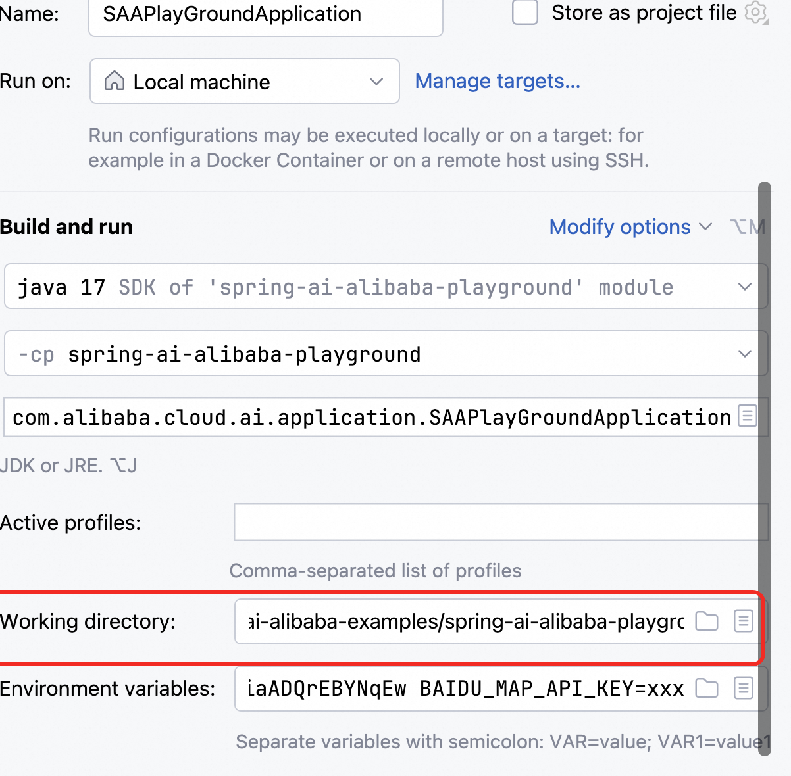

# Spring AI Alibaba Playground

## 快速体验

**1. 项目打包**
```shell
mvn clean install -DskipTests
```

**2. 配置环境变量**

Playground 作为一个 AI 智能体应用，依赖大模型等在线服务，需要通过环境变量指定访问凭证。具体 KEY 定义请参考 `application-dev.yml` 文件，以下是简单说明：

  - 【必须】[阿里云百炼 API-KEY](https://bailian.console.aliyun.com/?tab=model#/api-key)，大模型服务，示例 `export AI_DASHSCOPE_API_KEY=xxx`
  - 【可选】[百度翻译 appId 和 secretKey](https://api.fanyi.baidu.com/product/113)，使用 Tool Call 时必须，示例 `export BAIDU_TRANSLATE_APP_ID=xxx`、`export BAIDU_TRANSLATE_SECRET_KEY=xxx`
  - 【可选】[百度地图 api key](https://lbs.baidu.com/faq/api)，使用 Tool Call 必须，示例 `export BAIDU_MAP_API_KEY=xxx`
  - 【可选】[阿里云 IQS 服务 apikey](https://help.aliyun.com/document_detail/2870227.html?)，使用联网搜索必须，示例 `export IQS_SEARCH_API_KEY=xxx`
  - 【可选】[阿里云 AnalyticDB 向量数据库](https://help.aliyun.com/zh/analyticdb/analyticdb-for-postgresql/getting-started/instances-with-vector-engine-optimization-enabled/)，使用 RAG 时可开启（默认使用内存向量数据库）。先使用 `export VECTOR_STORE_TYPE=analyticdb` 开启 AnalyticDB，然后配置相关参数

**3. 运行项目**
```shell
java -jar ./target/app.jar
```

打开浏览器访问 `http://localhost:8080` 查看前端页面：

<p align="center">
    
</p>

## 本地开发

参考以下步骤在本地 IDE 环境中运行项目。

**1. 前端 UI 打包**

首先，需要运行以下命令将 `ui` 打包到 `classpath` 下。后续如果对 ui 有改动，请注意重新执行此命令才生效。

```shell
mvn clean install -DskipTests
```

**2. 切换 IDE 工作目录**

Playground 作为 `spring-ai-alibaba-examples` 仓库子项目，有以下两种 IDE 导入方式：
1. 作为独立项目单独导入
2. 作为整个 spring-ai-alibaba-examples 项目的子 module 导入

在使用子 module导入时，需要配置工作目录如下：

<p align="center">
    
</p>

**3. 导出环境变量**

Playground 作为一个 AI 智能体应用，依赖大模型等在线服务，需要通过环境变量指定访问凭证。具体 KEY 定义请参考 `application-dev.yml` 文件，以下是简单说明：

  - 【必须】[阿里云百炼 API-KEY](https://bailian.console.aliyun.com/?tab=model#/api-key)，大模型服务，示例 `export AI_DASHSCOPE_API_KEY=xxx`
  - 【可选】[百度翻译 appId 和 secretKey](https://api.fanyi.baidu.com/product/113)，使用 Tool Call 时必须，示例 `export BAIDU_TRANSLATE_APP_ID=xxx`、`export BAIDU_TRANSLATE_SECRET_KEY=xxx`
  - 【可选】[百度地图 api key](https://lbs.baidu.com/faq/api)，使用 Tool Call 必须，示例 `export BAIDU_MAP_API_KEY=xxx`
  - 【可选】[阿里云 IQS 服务 apikey](https://help.aliyun.com/document_detail/2870227.html?)，使用联网搜索必须，示例 `export IQS_SEARCH_API_KEY=xxx`
  - 【可选】[阿里云 AnalyticDB 向量数据库](https://help.aliyun.com/zh/analyticdb/analyticdb-for-postgresql/getting-started/instances-with-vector-engine-optimization-enabled/)，使用 RAG 时可开启（默认使用内存向量数据库）。先使用 `export VECTOR_STORE_TYPE=analyticdb` 开启 AnalyticDB，然后配置相关参数

**4. 运行 `SAAPlayGroundApplication`**

项目启动之后，浏览器访问 `http://localhost:8080` 查看前端页面。

## 常见问题与解决方法
1. 如果项目启动时出现数据库相关错误，需要手动在 resources 目录下的 db 创建 saa.db 文件；
2. 如果访问接口时，报 9411 端口相关错误，这是 zipkin 服务未启动原因，不影响接口调用；
3. swagger 接口：http://localhost:8080/doc.html；

