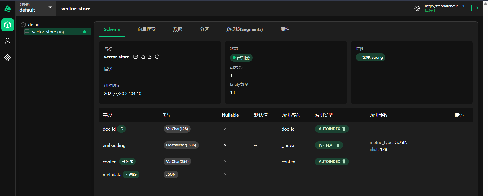

# Spring AI Alibaba Example

这个项目展示了如何使用 Spring AI Alibaba 集成 Milvus 进行向量搜索。

## Quick Start

- JDK 17
- Milvus (Docker Compose)

1. 通过 Docker Compose 安装 Milvus。

    - docker-compose 的 yml 文件见目录 `/spring-ai-alibaba-examples/docker-compose/milvus/docker-compose.yml`
    - 详细安装文档见地址：https://milvus.io/docs/install_standalone-docker-compose.md

2. 启动 Milvus；
3. 打开浏览器访问 `localhost:8000`，访问 dashboard；
4. 在 default 数据库创建 collection；

   

5. 打开 Milvus 向量检索；
6. 修改 application.yml 中的配置；
7. 运行本项目，在项目启动时会将数据导入 Milvus；
8. 在 dashboard 手动加载集合：

如果加载集合完成，将看到以下输出：


其中 Milvus 的配置如下：

> 注意：不同版本 Milvus 的配置略有不同，Milvus2.3.0 版本才原生支持 Cosine 距离，请根据实际情况调整

## 项目演示

### 1. 导入

```shell
# 注意：在执行查询前，应该手动加载集合。避免查询错误

# 向量查询
curl http://localhost:8080/ai/select
```

如果一切正常，将看到以下输出：

```json
[
  {
    "id": "fae19802-f6c0-42a6-8408-6c68dba55722",
    "text": "17. SpringAIAlibaba支持自然语言处理、计算机视觉、语音处理和数据分析与预测功能。",
    "media": null,
    "metadata": {
      "distance": 0.25151956
    },
    "score": 0.7484804391860962
  },
  {
    ....
  }
]
```

### 查询提问

浏览器访问：

http://localhost:8080/ai/chat?prompt="如何使用 spring ai alibaba 开发 ai 应用"

将看到如下输出：

```text
要使用 Spring AI Alibaba 开发 AI 应用，您可以按照以下步骤进行： 1. ......
```
