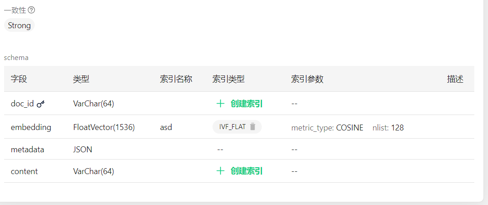

# Spring AI Alibaba Example

这个项目展示了如何使用 Spring AI Alibaba 集成 Milvus 进行向量搜索。

## Quick Start

- JDK 17
- Milvus (Docker)

1. 通过 Docker 安装 Milvus。
2. 启动 Milvus。
3. 创建 collection
4. 打开 Milvus 向量检索。
5. 修改 application.yml 中的配置。
6. 运行本项目

其中Milvus的配置如下：

